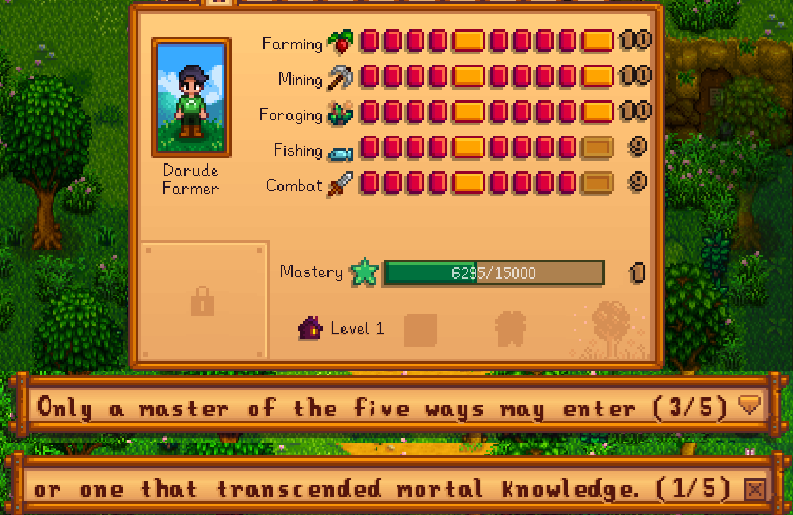
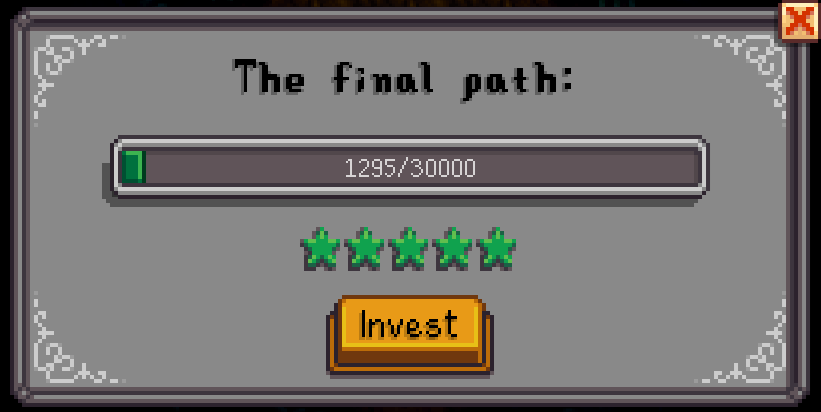
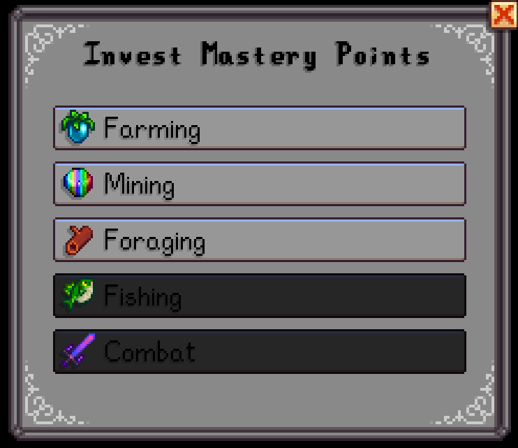
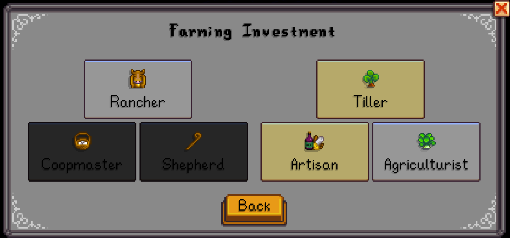

# Mastery Extended

Mastery Extended is a mod for Stardew Valley that aims to allow the player more options to use the Mastery system.

## Gaining Mastery Points

You can gain Mastery Points in the same way than in vanilla Stardew, but now you can start gaining them after you get level 10 in the corresponding skill, not only after getting level 10 in all of them.

## Accessing the Mastery Cave

Other than the normal method, you can also get access if you get to Mastery Level 5 (*configurable*).

## Where to invest

After getting access to the Mastery Cave, you can click on the pedestal to show the menu. 

Clicking the "Invest" button will show you the Skills Menu.

Clicking on one of the Skills will show you the Professions for that Skill.

Clicking on a Profession will add it to your character.

## Claiming Mastery Rewards
You can't unlock it immediately as before. Now you need to unlock at least one extra profession at the Pedestal.

## Config
After the first run, there will be a `config.json` file in the mod folder. You can edit the following settings:

Setting                  | How it works
------------------------ | ------
`MasteryExpPerLevel`     | Amount of experience points required for an extra Mastery Level after level 5. Default `30000`.
`MasteryRequiredForCave` | Mastery Levels required to access the Mastery Cave. Default `5`. 

## Plans
* Make compatible with custom skills
* Add **Upgrades**, another way to spend Mastery Levels