# Mastery Extended

Mastery Extended is a mod for Stardew Valley that aims to allow the player more options to use the Mastery system.

## Gaining Mastery Points

You can gain Mastery Points in the same way than in vanilla Stardew, but now you can start gaining them after you get level 10 in the corresponding skill, not only after getting level 10 in all of them.

## Accessing the Mastery Cave

Other than the normal method, you can also get access if you get to Mastery Level 5 (*configurable*).

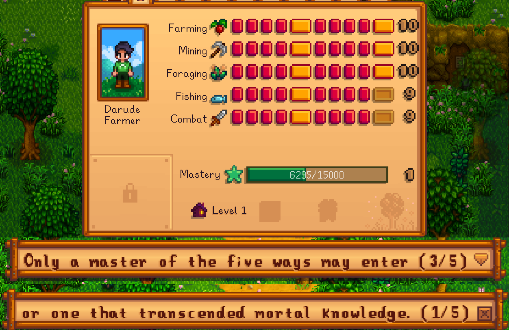

## Unlocking new Professions

After getting access to the Mastery Cave, you can click on the pedestal to show the menu. 

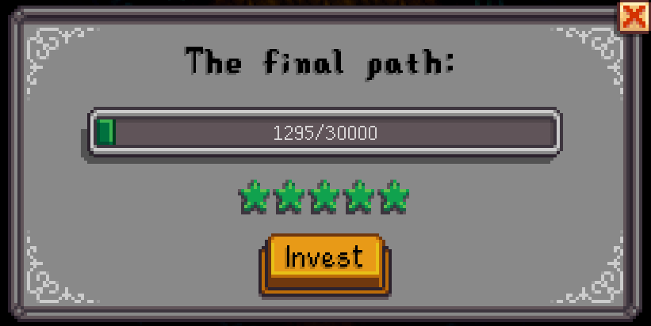

Clicking the "Invest" button will show you the Skills Menu.

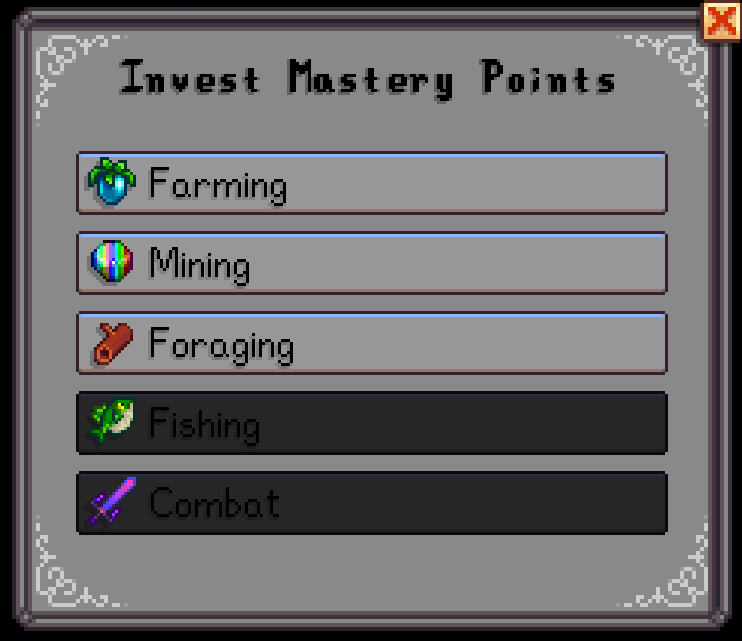

Clicking on one of the Skills will show you the Professions for that Skill.

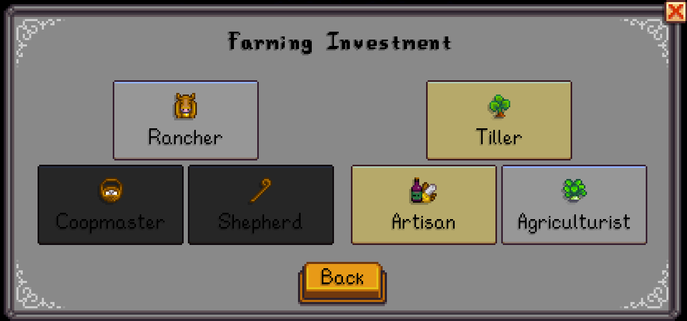

Clicking on a Profession will add it to your character.

### Claiming Mastery Rewards
You can't unlock it immediately as before. Now you need to unlock at least one extra profession at the Pedestal.

### Custom skills

All of the skills made using SpaceCore can be added

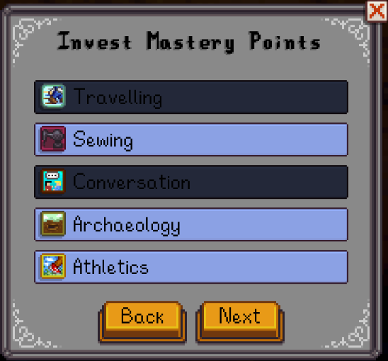

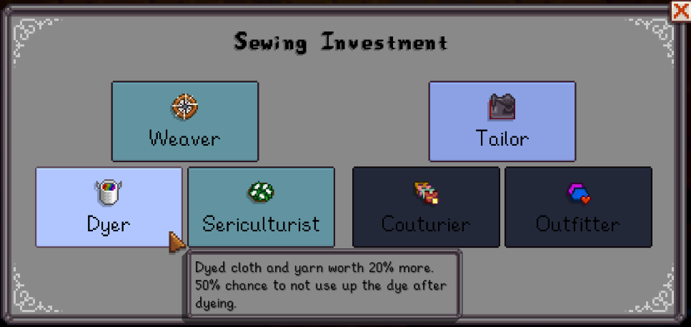

### Walk of Life - Prestige

The profession prestiging is unlocked after level 20. The prestiged professions show an unlocked star.

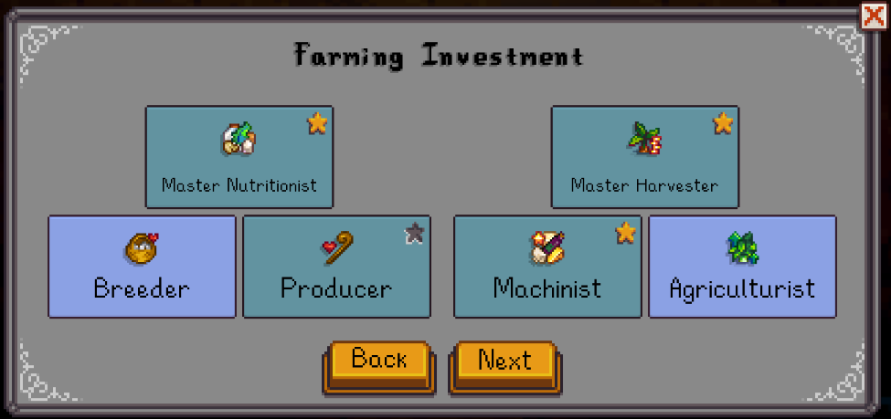

### Vanilla Plus Professions

The level 15 and 20 professions can be seen by pressing the "Next" button in the menu. They unlock as normal after getting to level 20.

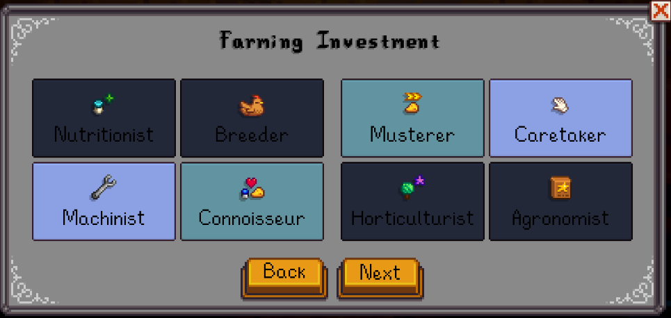

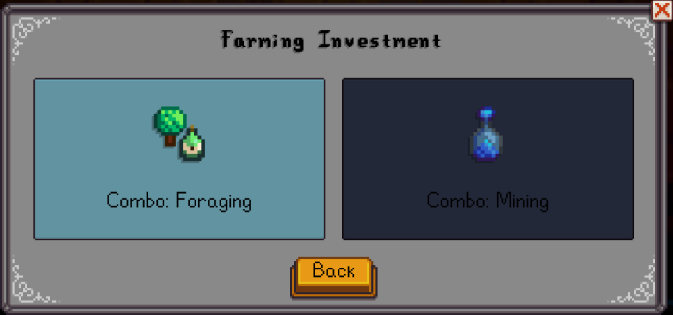

## Profession Books

After unlocking a profession, a new book is added to the bookseller. The title is a song related to the profession unlocked.

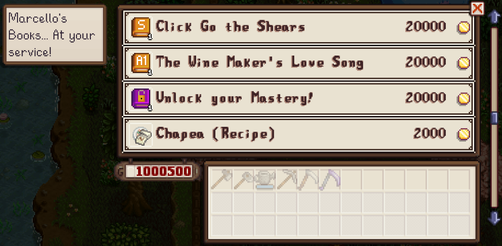

This will increased your XP gain in the corresponding skill

## Powers

At the sewers you can talk to the dog statue to unlock new powers.

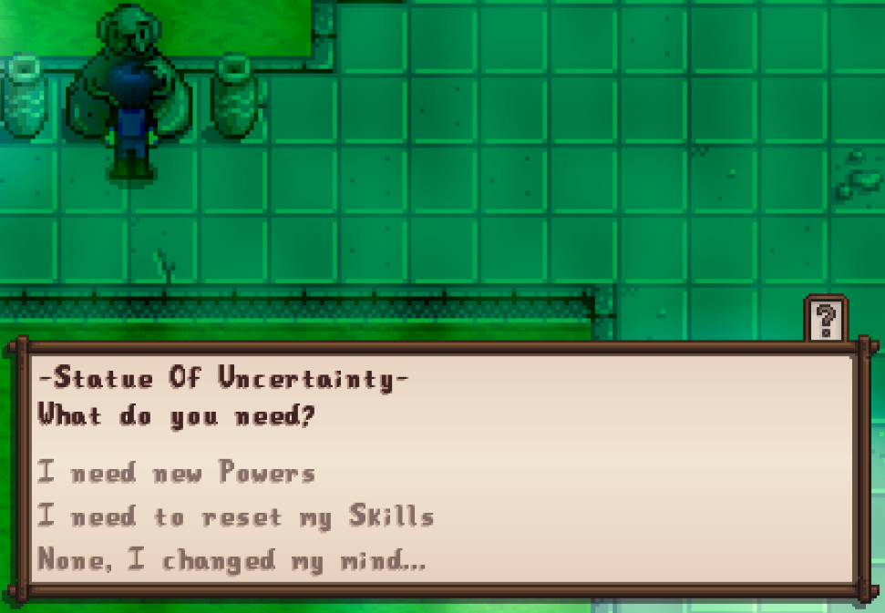

## Config

Hint: You should really use GMCM.
After the first run, there will be a `config.json` file in the mod folder. You can edit the following settings:

Setting                        | How it works
------------------------------ | ------
`MasteryExpPerLevel`           | Amount of experience points required for an extra Mastery Level after level 5. Default `30000`.
`BooksQuantity`                | Books added to the bookseller. Default `Full`. Other options: `Lite`, `None`.
`BookPrice`                    | Price of each book. Default `20000`.
`EnableDogPowers`              | Enable Powers on the Dog Statue in the sewers. Default `true`.
`MasonDrops`                   | What is dropped by the Mason Power. Default `Everything`. Other option: `StoneAndClay`.
`SkillNameOnMenuHover`         | Show the Skill name when hovering on Professions in the Skill Menu. Default `true`. 
`ProfessionNameOnMenuHover`    | Show the Profession name when hovering on Professions in the Skill Menu. Default `true`. 
`SkillsVsMasteryPoints`        | How to access the Mastery Cave. Default `SkillOrMastery`.
`IncludeCustomSkills`          | Count Custom skills for the `SkillsVsMasteryPoints` option. Default `true`.
`SkillsRequiredForMasteryRoom` | Level 10 skills needed to unlock the Mastery Room. Default `5`.
`MasteryRequiredForCave`       | Mastery Levels required to access the Mastery Cave. Default `5`. 
`PillarsVsProfessions`         | How Professions and Pillars interact. Default `Professions`. Other options: `Pillars`, `None`.
`RequiredProfessionForPillars` | How many professions you need unlocked for the Mastery Pillar. Default `3`. 
`RequiredPilarsToThePedestal`  | How many Mastery Pillar you need unlocked to unlock professions. Default `3`.
`ConfirmProfession`            | Show confirmation banner when unlocking a profession in the cave. Default `true`.

### WoL/VPP Config
Setting                        | How it works
------------------------------ | ------
`MasteryPercentage`            | When you are between level 10 and 19, this percentage of Experience will go to Mastery Exp and the rest to the Skill Exp. Default `20`.

If you don't want to share exp, just set it to 0.

### VPP Config

Setting                        | How it works
------------------------------ | ------
`Lvl10ProfessionsRequired`     | How many Level 10 Professions you need to be able to unlock a Level 15 Profession. Default `2`. 
`Lvl15ProfessionsRequired`     | How many Level 15 Professions you need to be able to unlock a Level 20 Profession. Default `4`. 